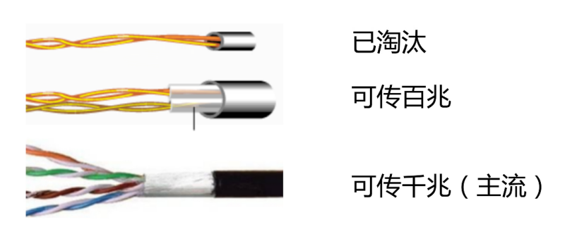
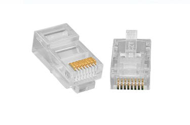
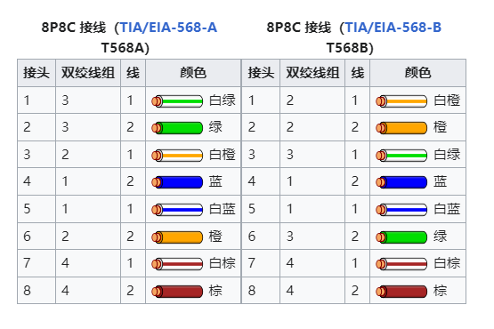

# 传输介质

两个终端，用一条能承载数据传输的传输介质连接起来，就组成了一个最简单的网络。

# 无线传输介质

无线传输介质分为无线电波、微波、红外线、激光。

无线电波：500kHz - 1000MHz，是能量最小、波长最高、频率最低的电磁波。用于广播电视和无线通信。

微波：300MHz - 300GHz，是一种波长较低、频率较高的电磁波，特点是高频高能量。用于雷达、飞机导航。

## 频段划分及主要用途

<table>
      <thead>
        <tr>
          <th align="center" colspan="5">频段划分及主要用途</th>
        </tr>
      </thead>
      <tbody>
        <tr>
          <td align="center">频段范围（含上限）</td>
          <td align="center">频段名称</td>
          <td align="center" colspan="2">波段名称</td>
          <td align="center">主要用途</td>
        </tr>
        <tr>
          <td align="center">3Hz ~ 30Hz</td>
          <td align="center">极低频（ELF）</td>
          <td align="center" colspan="2">极长波</td>
          <td>远程导航、水下通信</td>
        </tr>
        <tr>
          <td align="center">30Hz ~ 300Hz</td>
          <td align="center">超低频（SLF）</td>
          <td align="center" colspan="2">超长波</td>
          <td>水下通信</td>
        </tr>
        <tr>
          <td align="center">300Hz ~ 3000Hz</td>
          <td align="center">特低频（ULF）</td>
          <td align="center" colspan="2">特长波</td>
          <td>远程通信</td>
        </tr>
        <tr>
          <td align="center">3kHz ~ 30Hz</td>
          <td align="center">甚低频（VLF）</td>
          <td align="center" colspan="2">甚长波</td>
          <td>音频电话、长距离导航、时标</td>
        </tr>
        <tr>
          <td align="center">30kHz ~ 300kHz</td>
          <td align="center">低频（LF）</td>
          <td align="center" colspan="2">长波</td>
          <td>船舶通信、信标、导航</td>
        </tr>
        <tr>
          <td align="center">300kHz ~ 3000kHz</td>
          <td align="center">中频（MF）</td>
          <td align="center" colspan="2">中波</td>
          <td>广播、船舶通信、飞行通信、船港电话</td>
        </tr>
        <tr>
          <td align="center">3MHz ~ 30MHz</td>
          <td align="center">高频（HF）</td>
          <td align="center" colspan="2">短波</td>
          <td>短波广播、军事通信</td>
        </tr>
        <tr>
          <td align="center">30MHz ~ 300MHz</td>
          <td align="center">甚高频（VHF）</td>
          <td align="center" colspan="2">米波</td>
          <td>电视、调频广播、雷达、导航</td>
        </tr>
        <tr>
          <td align="center">300MHz ~ 3000MHz</td>
          <td align="center">特高频（UHF）</td>
          <td align="center">分米波</td>
          <td align="center" rowspan="5">微波</td>
          <td>电视、调频广播、雷达、导航</td>
        </tr>
        <tr>
          <td align="center">3GHz ~ 30GHz</td>
          <td align="center">超高频（SHF）</td>
          <td align="center">厘米波</td>
          <td>雷达、中继、卫星通信</td>
        </tr>
        <tr>
          <td align="center">30GHz ~ 300GHz</td>
          <td align="center">极高频（EHF）</td>
          <td align="center">毫米波</td>
          <td>雷达、射电天文、卫星通信</td>
        </tr>
        <tr>
          <td align="center">300GHz ~ 3000GHz</td>
          <td align="center">至高频</td>
          <td align="center">丝米波</td>
          <td>---</td>
        </tr>
        <tr>
          <td align="center">43THz ~ 430THz</td>
          <td align="center">红外</td>
          <td align="center">微米波</td>
          <td>光通信系统</td>
        </tr>
        <tr>
          <td colspan="5">注：1kHz=103Hz, 1MHz=106Hz, 1GHz=109Hz, 1THz=1012Hz, 1mm=10-3m, 1µm=10-6m, </td>
        </tr>
      </tbody>
    </table>

## 微波波段

| 名称 | P 波段 | L 波段 | S 波段 | C 波段 | X 波段 | Ku 波段 | K 波段 | Ka 波段 |
| --- | --- | --- | --- | --- | --- | --- | --- | --- |
| 频率 | 230-1000MHz | 1-2GHz | 2-4GHz | 4-8GHz | 8-12.5GHz | 12.5-18GHz | 18-26.5GHz | 26.5-40GHz |

# 有线传输介质

有线传输介质主要有同轴电缆、双绞线、和光纤。

## 双绞线

由多对绝缘铜导线两两相互缠绕而成。

缠绕目的：降低信号干扰的程度。

# 网线

传输 100M：用 4 根，2 对（1、2、3、6）。

传输 1000M：用 8 根，全部使用

**注**：网线传输距离 100 米。

## 非屏蔽双绞线（UTP）

绝缘套管中无屏蔽层。

价格低廉，用途广泛。

企业、教育

## 屏蔽双绞线（STP）

绝缘套管中外层由铝箔包裹，以减小辐射/干扰。

价格相对较高，高要求场合应用。

军队政府、医疗、航空航天、高精密场景。

# 水晶头

网口：RJ45 水晶头

电话口：RJ11 水晶头

# 水晶头接线

# 双绞线标准

<table align="center">
   <tr>
     <td>名称</td>
     <td>标准</td>
   </tr>
   <tr>
     <td>CAT-3</td>
     <td>
       目前以TIA/EIA-568.2-D所界定及承认。提供16MHz的带宽。曾经常用在 10
       Mbit/s 以太网络。
     </td>
   </tr>
   <tr>
     <td>CAT-4</td>
     <td>
       目前以TIA/EIA-568.2-D所界定及承认。提供20MHz的带宽。以往常用在 16
       Mbit/s 的令牌环网络。
     </td>
   </tr>
   <tr>
     <td>CAT-5</td>
     <td>
       目前以TIA/EIA-568.2-D所界定及承认。提供100MHz的带宽。目前常用在快速以太网（100
       Mbit/s）中。
     </td>
   </tr>
   <tr>
     <td>CAT-5e</td>
     <td>
       目前以TIA/EIA-568.2-D所界定及承认。提供125MHz的带宽。目前常用在千兆以太网（1000Mbit/s）中。
     </td>
   </tr>
   <tr>
     <td>CAT-6</td>
     <td>
       目前以TIA/EIA-568.2-D所界定及承认。提供250MHz的带宽，最高传输速度是1Gbit/s
     </td>
   </tr>
   <tr>
     <td>CAT-6A</td>
     <td>
       目前以TIA/EIA-568.2-D所界定及承认。提供500MHz的带宽，使用在万兆以太网（10
       Gbit/s）中。
     </td>
   </tr>
   <tr>
     <td>CAT-7</td>
     <td>
       为ISO/IEC 11801 Class
       F线缆标准的非正式名称。此标准定义4对各别屏蔽的双绞线包覆在一个屏蔽内。设计供以600MHz频率传输信号。
     </td>
   </tr>
   <tr>
     <td>CAT-8/Class I</td>
     <td>
       目前以TIA/EIA-568.2-D所界定及承认。提供2000MHz的带宽，使用在四万兆以太网（40
       Gbit/s）中。(ISO / IEC 11801-1 2017-11版，定义为 Class I）使用 8P8C
       连接器。
     </td>
   </tr>
   <tr>
     <td>CAT-8.2/Class II</td>
     <td>
       目前以ISO/IEC 11801-1
       2017-11版所界定及承认。提供2000MHz的带宽，使用在四万兆以太网（40
       Gbit/s）中。使用 TERA 或 GG45 连接器。
     </td>
   </tr>
</table>

TIA/EIA：电信工业协会/电子工业协会

# 光纤

利用光在玻璃或塑料纤维中的全反射原理达成的光传导工具。

光在光纤中传导损耗很低，适合用作长距离信息传递。

光纤特点：重量轻、体积小、传输远、衰减小、容量大、抗电磁干扰。

## 单模光纤

只允许一种模式光信号传播，单模光纤具有极宽的带宽，特别适用与大容量、长距离的光纤通信。

## 多模光纤

允许多种模式光信号传播，多模光纤仅用于较小容量、短距离的光纤传输通信。

 <table align="center">
   <tr>
     <td rowspan="2">型号</td>
     <td rowspan="2">波长</td>
     <td colspan="2">常用型号</td>
   </tr>
   <tr>
     <td>芯径µm</td>
     <td>外层µm</td>
   </tr>
   <tr>
     <td rowspan="3">多模光纤</td>
     <td rowspan="3">850nm 或 1300nm</td>
     <td>50</td>
     <td>125</td>
   </tr>
   <tr>
     <td>62.5</td>
     <td>125</td>
   </tr>
   <tr>
     <td>100</td>
     <td>140</td>
   </tr>
   <tr>
     <td>单模光纤</td>
     <td>1310nm 或 1550nm</td>
     <td>8.3</td>
     <td>125</td>
   </tr>
 </table>

## 单模与多模对比

| 标识 | SX | LX | LH/ZH |
| --- | --- | --- | --- |
| 波长 | 短波 850nm | 长波 1310nm | 超长波 1550nm |
| 距离 | 220 ~ 550m | 10km | 10 ~ 120km |
| 类型 | 多模 | 单模 | 单模 |
| 颜色 | 橘黄色/浅绿色 | 黄色 | 黄色 |
| 光源 | 发光二极管 LED 或激光二极管 LD | 激光二极管 LD 或发光二极管 LED | 激光二极管 LD 或发光二极管 LED |

# 光缆

光缆一般由多根光纤和保护套管及塑料外皮构成。
