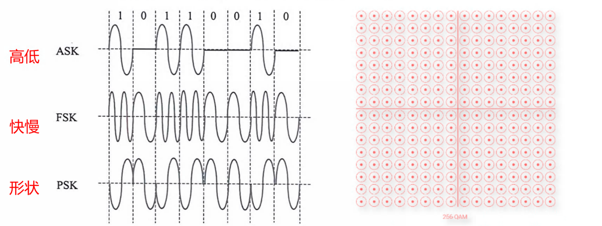

# 数字调制技术

数字数据不仅可以用脉冲传输，也可以用模型信号传输。用数字数据调制模拟信号叫做数字调制。

- 幅度键控（ASK）：用载波的两个不同振幅表示 0 和 1.
- 频移键控（FSK）：用载波的两个不同频率表示 0 和 1.
- 相移键控（PSK）：用载波的起始相位的变化表示 0 和 1.
- 正交幅度调制（QAM）：把两个幅度相同但相位差 90° 的模拟信号合成一个模拟信号。

码元只取两个相位值叫 2 相位调制，则 N=2；码元可取 4 个相位叫 4 相调制，则 N=4.

DPSK 是 2 相调制，N=2；QPSK 是 4 相调制，N=4.

