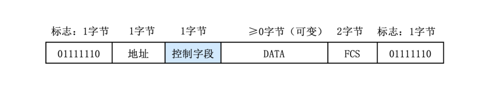

# 通信和交换方式

## 按通信方式分

- 单工通信：信息只能在一个方向传送，发送方不能接收，接收方不能发送（电视/广播）。
- 半双工通信：通信的双方可以交替发送和接收信息，但不能同时接收和发送（对讲机/WiFi/Hub）。
- 全双工通信：通信双方可同时进行双向的信息传送（电话/交换机）。

## 按同步方式分

- 异步传输： 把各个字符分开传输，在字符之间插入同步信息，典型的是插入起始位和停止位。HDLC 是典型的异步传输，HDLC 帧格式如图所示，起始标志位和结束标志位都是 `01111110`。异步传输的优点是实现简单，但引入起止位，会影响传输效率，导致速率不会太高。 

- 同步传输：发送方在传送数据之前，先发送一串同步字符 SYNC，接收方检测到 2 个以上 SYNC 字符就确认已经进入同步状态，开始准备接收数据。同步传输效率更高，在短距离高速数据传输中，大多采用同步传输方式。

## 按数据交换方式

- 电路交换：将数据传输分为电路建立、数据传输和电路拆除 3 个过程。在数据传送之前需建立一条物理通路，在线路被释放之前，该通路将一直被用户完全占有。（代表：早期电话）
- 报文交换：报文从发送方传送到接收方采用存储转发的方式。报文中含有没一个下一条节点，完整的报文在一个个节点间传送（数据不拆分）。（代表：早期电报）
- 分组交换：将数据拆分成很小的分组进行传送，包括：数据报和虚电路。（代表：互联网）
  - 数据报：每个分组被独立地处理，每个节点根据路由选择算法，被独立送到目的，路径和到达目的顺序都可能不一样。（代表：IP）
  - 虚电路：在数据传送之前，先建立起一条逻辑上的连接，每个分组都沿着一条路径传输，不会乱序。（代表：X.25、FR、ATM）

分组交换的优势：
- 减小延迟，提高了吞吐量。
- 分组交换可以按分组纠错，发现错误只需重发出错的分组，通信效率提高。