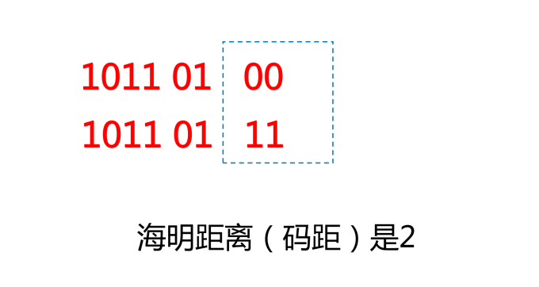
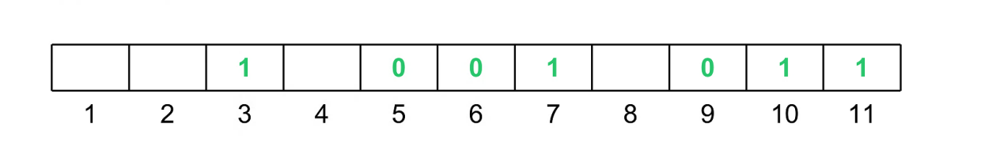
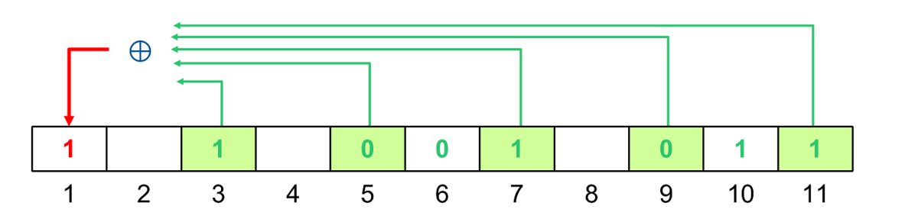

# 海明码纠错码

## 差错控制

数据传输中出现错误不可避免，因此需要采用差错控制方法。数据通信中常用的办法是检错和纠错。

- 检错：接收方知道有差错发生，但不知道是怎样的差错，发送方请求重传。
- 纠错：接收方知道有差错发生，而且知道是怎样的差错。

差错控制原理：传输 k 位，加入 r 位冗余（某种算法定义），接收方收到进行计算比较。

## 奇偶校验

奇偶校验是最常用的检错方法，能检出一位错位。

- 原理：在 7 位 ASCII 码后增加一位，使码字中 1 的个数成奇数（奇校验）或偶数（偶校验）。
- 奇校验：整个校验码（有效信息位和校验位）中 “1”的个数为奇数 `1011 010[1]`。
- 偶校验：整个校验码（有效信息位和校验位）中 “1”的个数为偶数 `1011 010[0]`。

## 海明码

海明（Hamming）码是通过冗余数据位来检测和纠正差错的编码方式。

海明距离（码距）：一个码字要求变成另一个码字时必须改变的最小位数。两个码字之间不同的比特数。

## 海明码原理

海明码原理：在数据中加入几个校验码，码距均匀拉大，当某一个出错，会引起几个校验位的值发生变化。

海明不等式：校验码个数为 k，可以表示 2k个信息，1 个信息用来表示“没有错误”，其余 2k - 1 个表示数据中存在错误，如果满足 $ 2^k - 1 ≥ m + k $（m 为信息为，m+k 为编码后的数总长度），则在理论上 k 个校验码就可以判断是哪一位出现了问题。

海明码编码：第 2i（i=0,1,2,3...）位是校验位，其余位存放数据。

假设传送信息 1001011，把数据放在 3,5,6,7,9,10,11 位置，1,2,4,8 留作校验位。

校验位与数据位的关系：3=2+1、5=4+1、6=4+2、7=4+2+1、9=8+1、10=8+2、11=8+2+1

则 3,5,7,9,11 号位参加第一位校验，若按偶校验计算，1 号位应为 1。

