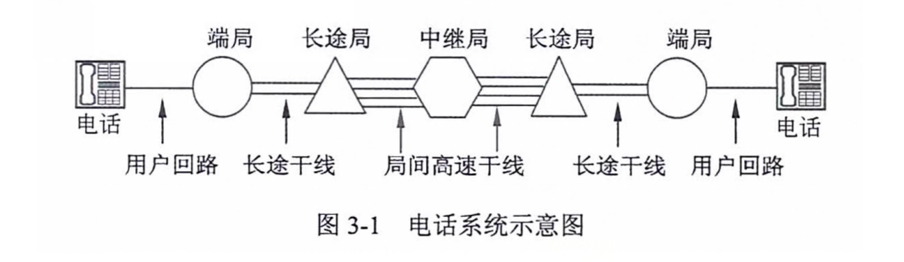
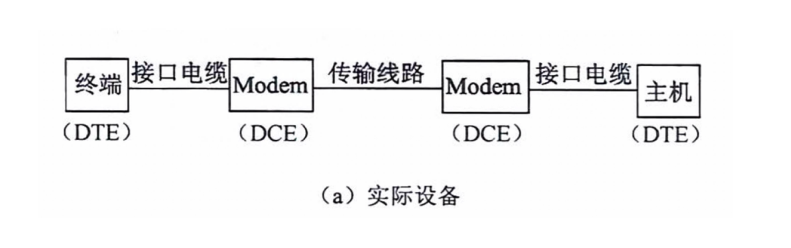
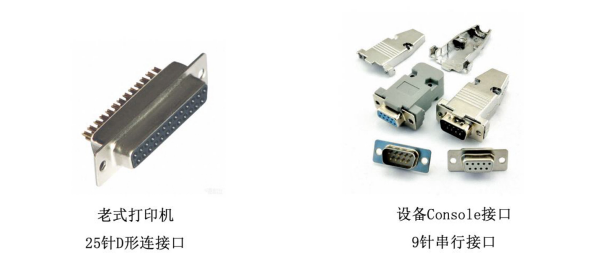
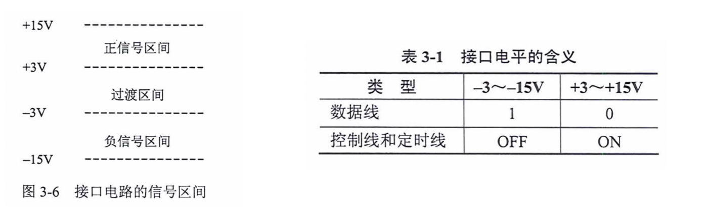

# 公共交换电话网 PSTN

- 在公共交换电话网（Public Switched Telephone Network，PSTN）是为了语音通信而建立的网络，从 20 世纪 60 年代开始又被用于数据传输。
- 电话网络由 3 个部分组成：本地回路、干线、交换机。
- 干线和交换机一般采用数字传输和交换技术，而本地回路基本采用模拟线路。
- 电话线联网时需要在发送端通过调制解调器把数字信号变换为模拟信号，接收端再通过调制解调器把模拟信号变换为数字信号。

# 本地回路

- DTE（Data Terminal Equipment）数据终端设备，这种设备代表通信链路的端点（PC/电话机）。
- DCE（Data Circuit Equipment）数据电路设备，用于信号变换器、自动呼叫等（猫/调制解调器/Modem）。

# 机械特性

机械特性描述 DTE 和 DCE 之间物理上的分界线，规定连接器的几何形状、尺寸大小、引线数、引线排列方式及锁定装置等。

RS-232-C 没有正式规定连接器的标准，只有再其附录中建议使用 25 针的 D 型连接器，也有很多使用其它连接器，特别时再微型机 RS-232-C 串行接口上，大多使用 9 针连接器。

# 电气特性

- RS-232-C 采用的 V.28 标准电路，速率 20kb/s，最长 15 米。
- 信号源产生 3-15V 的信号，±3V 之间是信号电平过渡区。
- 3-15V 表示 1，-3-15V 表示 0。

