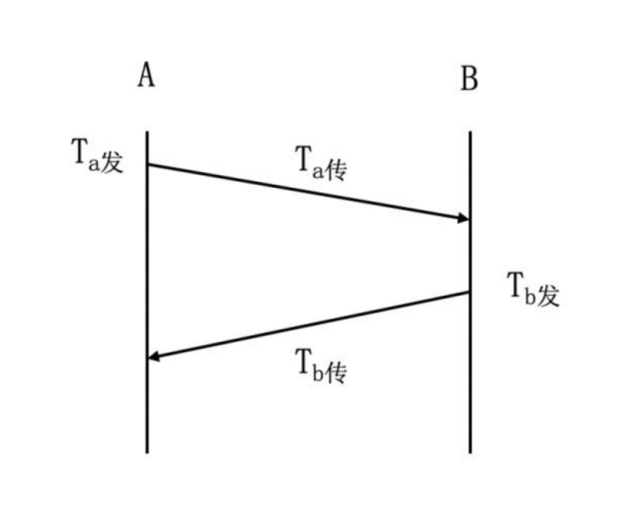

# 流量控制和差错控制

流量控制：协调发送站和接收站工作步调，避免发送速度过快，接收站处理不过来。（X.25、TCP）

差错控制：检测和纠正传输错误机制。

- 检错码：CRC
- 纠错码：海明码

# 停等协议

工作原理：发送站发送一帧，收到应答信号后再发送下一帧，接收站每收到一帧后回送一个应答信号（ACK），表示愿意接收下一帧，如果接收站不应答，发送站必须等待。

一次发送所需时间：T = Ta 发 + Ta 传 + Tb 发 + Tb 传 ≈ Ta 发 + 2T 传

# 滑动窗口协议

- 滑动窗口协议主要思想是：允许连续发送多个帧而无需等待应答。
- 如图假设 A 和 B 通过全双工链路连接，B 维持能容纳 8 个帧的缓冲区（W收 = 8）。
- 这样 A 就可以连续发送 8 个帧而不必等待应答信号（W发 = 8）。

# 停等 ARQ 协议

- 等待 ARQ 协议是停等流控技术和自动请求重发技术的结合。
- 发送站发出一帧后必须等待应答信号，收到肯定应答信号 ACK 后继续发送下一帧；收到否定应答信号 NAK 后重发该帧；若在一定的时间内没有收到应答信号也必须重发。

# 选择重发 ARQ 协议和后退 N 帧 ARQ 协议

- 选择重发 ARQ：重传特定的某一帧 W发 = W收 ≤ 2k-1。
- 后退 N 帧 ARQ：重传此帧和后续的 N 帧 W发 = W收 ≤ 2k - 1。
- 

