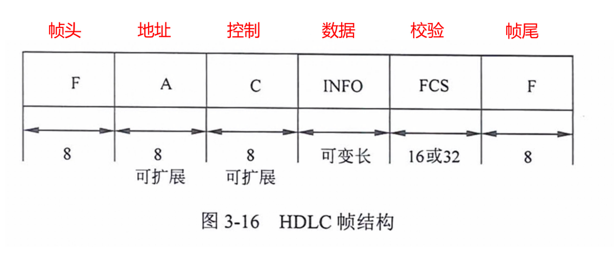
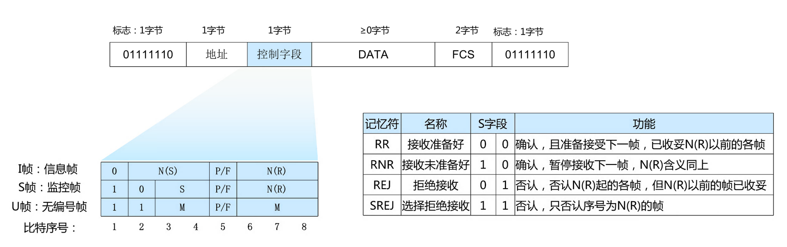

# 帧中继 FR （Frame Rlay）

- 帧中继在第二层建立虚电路，提供虚电路服务，本地标识 DLCI。
- 基于分组交换的透明传输，可提供面向连接的服务。
- 只做检错和拥塞控制，没有流控和重传机制，开销很少。
- 即可以按照需要提供带宽，也可以应对突发的数据传输。CIR：承诺速率，EIR：扩展速率。
- 帧长可变，长度可达 1600-4096 字节，可以承载各种局域网的数据帧。
- 可以达到很高的速率，2~45Mbps。
- 不适合对延迟敏感的应用（语音、视频）。
- 数据的丢失依赖于运营商对虚电路的配置。
- 不保障可靠的提交。

# ISDN 和 ATM

- ISDN 综合数字业务网，目的是以数字系统代替模拟电话系统，把音频、视频、数据业务放在一个网上统一传输。
- 分为窄带 ISDN 和宽带 ISDN，窄带 ISDN 提供两种用户接口。
  - 基本速率 BRI = 2B + D = 144kbps。
  - 基群速率 PRI = 30B + D = 2.048M。
- 宽带 ISDN，即 ATM。
  - ATM 是信元交换，信元为 53 字节固定长度。
  - ATM 依然是以虚链路提供面向连接的服务。
  - ATM 典型速率为 150M。

# HDLC（High Level Data Link Control，高级数据链路控制）

- HDLC 是一种面向位（比特）的同步链路控制协议。
- 通常使用 CRC-16、CRC-32 校验，帧边界 `01111110`。

# HDLC 帧格式及控制字段

- 信息帧（I 帧）：第一位为 0，用于承载数据和控制。
  - N（S）表示发送帧序号，N（R）表示下一个预期要接收帧的序号，N（R） = 5，表示下一帧要接收 5 号帧。N（S）和 N（R）均为 3 位二进制编码，可取值 0~7。
- 监控帧（S 帧）：前两位为 10，监控帧用于差错控制和流量控制。
  - S 帧控制字段的第三、四位为 S 帧类型编码，共有四种不同编码，含义如上表所示。
- 无编号帧（U 帧）：控制字段中不包含编号 N（S）和 N（R），U 帧用于提供对链路的建立、拆除以及多种控制功能，但是当要求提供不可靠的无连接服务时，它有时也可以承载数据。
