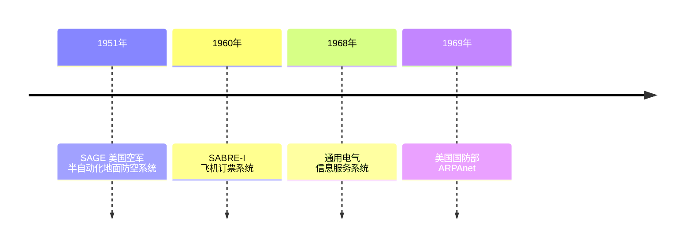
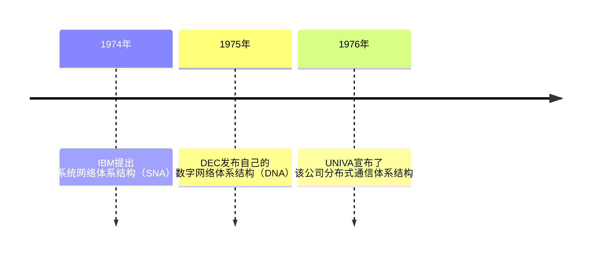
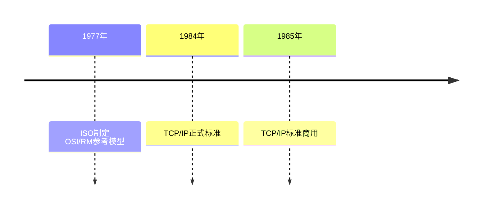
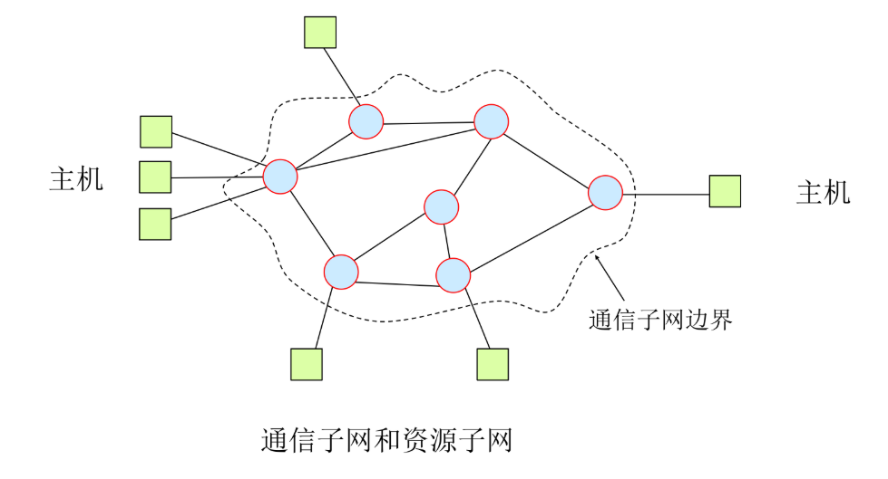
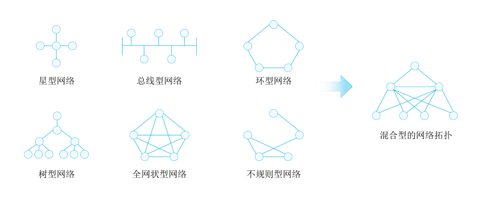

# 计算机网络

**计算机网络**：计算机技术（IC）与通信技术（CT）的结构（ICT）。

# 计算机网络发展

## 早期网络



## 厂商独立发展阶段



## 标准阶段



# 计算机网络分类 1：通信子网和资源子网



**通信子网**：通信节点（集线器、交换机、路由器等）和通信链路（电话线、同轴电缆、无线电线缆、卫星线路、微波中继线路和光纤缆线）。

**用户资源子网**：PC、服务器等。

# 计算机网络分类 2： 网络拓扑结构

**网络拓扑结构**：星型网络、总线型网络、环形网络、树型网络、全网状型网络、不规则型网络、混合型网络拓扑。



# 计算机网络分类 3： PAN LAN MAN WAN

按照覆盖范围可以把网络分为`个域网（PAN）`、`局域网（LAN）`、`城域网（MAN）`、`广域网（WAN）`

| 分类 | 个域网 | 局域网 | 城域网 | 广域网 |
| --- | --- | --- | --- | --- |
| 地理范围 | 一般 20m 以内 | 大楼内、园区内部 | 建筑物之间、城区内 | 国内、国际 |
| 所有者和运营者 | 个人 | 局域网拥有者 | 城域网主管部门 | 运营商 |
| 典型案例 | 蓝牙、家庭 WiFi | 校园网、企业内部网络 | 教育城域网、运营商城域网 | 运营商骨干网 |

# 计算机网络分类 4： 其它分类方式

- 按交换技术分类：电路交换网络、报文交换网络、分组交换网络。
  ```mermaid
  flowchart LR
    A(交换方式) --> B(电路交换) --> C(电信的传统电话，独占资源，比如PBX支持1000路电话，在前面用户没断之前，第1001个人肯定不能接通)
    A --> B1(报文交换) --> C1(类似快递，将完整的数据一跳一跳进行传送)
    A --> B2(分组交换) --> C2(将原始数据进行拆散，一跳一跳进行传输)
    B2 --> C3(虚电路（X.25、FR、ATM）) --> D3(传送数据之前先建立虚电路，以后数据都通过虚电路进行传输，路径保持一致)
    B2 --> C4(数据报（IP）) --> D4(传送之前不用建立虚电路，数据到达目的地可走多条路径)
  ```
- 按采用协议分类：IP 网、IPX 网等。
- 按传输介质分类：无线网、有线网；有线网又能分为双绞线网络、同轴电缆网络、光纤网络等。
- 按用途分类：教育网络、科研网络、商业网络、企业网络。
