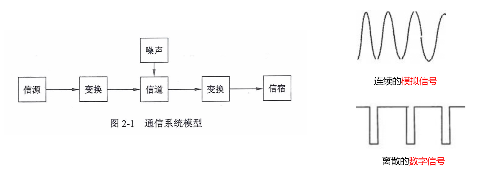
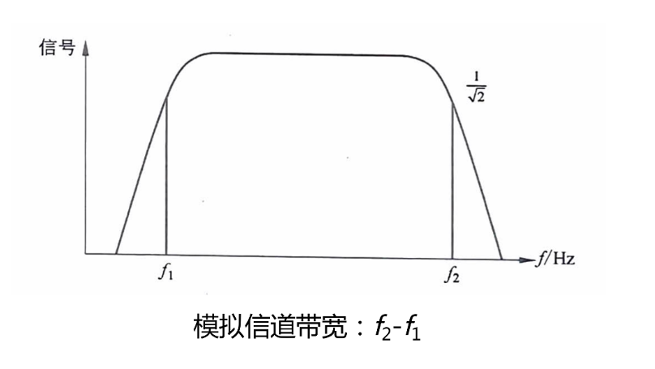
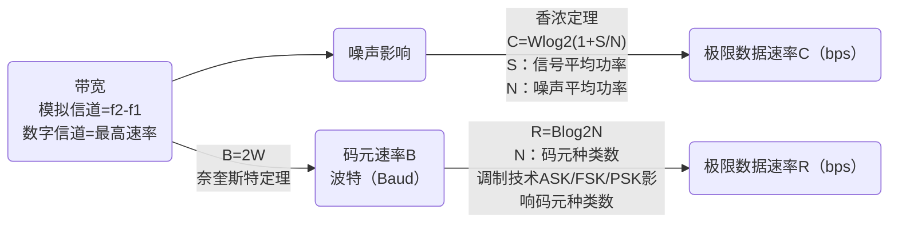

# 数据通信的概念

通信的目的就师传递信息。

通信中产生和发送信息的一端叫信源，接收信息的一端叫信宿，信源和信宿之间的通信线路称为信道。

信号主要有两种类型：模拟信号（连续的）和数字信号（离散的）。

# 信道特性 - 信道带宽 W

模拟信道：$ W=f_2-f_1 $ ，$ f_2 和 f_1 $ 分别表示：信道能通过的最高/最低频率，单位是赫兹(Hz)。

数字信道：数字信道是离散信道，带宽为信道能够达到的最大数据传输速率，单位是比特每秒(bit/s)。

# 信道特性 - 码元和码元速率

码元：一个数字脉冲称为一个码元。数字信道系统中的基本信号单位，它是用来表示数字信息的最小单位。

码元速率：单位时间内信道传送的码元个数。如果码元宽度（脉冲周期）为 T，则码元速率（波特率）为 $ B=1/T $，单位是波特（Baud）。

数据速率：单位时间内通过信道传输的信息量，通常以比特（bit）为单位，表示每秒传输的比特数。

一个码元携带信息量 n 与码元种类 N 的关系 $ n = log_2N $。

# 信道特性 - 奈奎斯特定理

奈奎斯特定理：在一个理想（没有噪声环境）信道中，若信道带宽为 W，最大码元速率为：$ B=2W $(Baud)。

极限速率：$ R = Blog_2N = 2Wlog_2N $

# 信道特性 - 香农定理

香农定理：在一个噪声信道的极限数据速率和带宽之间的关系。

极限速率公式：$ C = Wlog_2(1+S/N) $

分贝与信噪比关系：dB = 10log10 S/N

- BPSK 是二进制相移键控，N=2。
- QPSK 是四进制相移键控，N=4。

## 带宽/码元速率/数据速率关系

