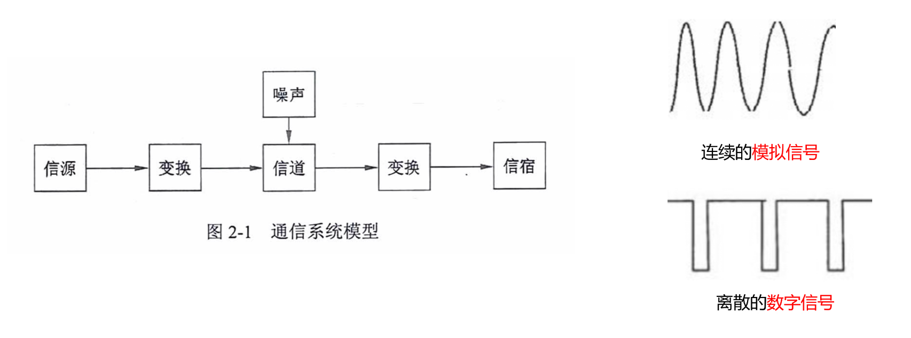

# 数据通信的概念

通信的目的就师传递信息。

通信中产生和发送信息的一端叫信源，接收信息的一端叫信宿，信源和信宿之间的通信线路称为信道。

信号主要有两种类型：模拟信号（连续的）和数字信号（离散的）。

# 信道特性 - 信道带宽 W

模拟信道：$ W=f_2-f_1 $ ，$ f_2 和 f_1 $ 分别表示：信道能通过的最高/最低频率，单位是赫兹(Hz)。

数字信道：数字信道是离散信道，带宽为信道能够达到的最大数据传输速率，单位是比特每秒(bit/s)。

# 信道特性 - 码元和码元速率

码元：一个数字脉冲称为一个码元。数字信道系统中的基本信号单位，它是用来表示数字信息的最小单位。

码元速率：单位时间内信道传送的码元个数。如果码元宽度（脉冲周期）为 T，则码元速率（波特率）为 $ B=1/T $，单位是波特（Baud）。

数据速率：单位时间内通过信道传输的信息量，通常以比特（bit）为单位，表示每秒传输的比特数。

一个码元携带信息量 n 与码元种类 N 的关系 $ n = log_2N $。

# 信道特性 - 奈奎斯特定理

奈奎斯特定理：在一个理想（没有噪声环境）信道中，若信道带宽为 W，最大码元速率为：$ B=2W $(Baud)。

极限速率：$ R = Blog_2N = 2Wlog_2N $

# 信道特性 - 香农定理

香农定理：在一个噪声信道的极限数据速率和带宽之间的关系。

极限速率公式：$ C = Wlog_2(1+S/N) $

分贝与信噪比关系：dB = 10log10 S/N

- BPSK 是二进制相移键控，N=2。
- QPSK 是四进制相移键控，N=4。

## 带宽/码元速率/数据速率关系

# 信道延迟

信道延迟：与源端和宿端距离有关，也与信道中的信号传播速率有关。

总延时 = 线路延迟 + 发送延迟

线路延迟 = 传输距离/传输速度（路上跑的时间） 比如 1000 米电缆，延时为 5µs。

发送延迟 = 数据帧大小/速率（等待时间） 比如 100M 线路，发送 1000 字节数据，延时为 1000\*8/(100\*106) = 80µs

- 光速为 3000000km/s = 300m/µs
- 电缆中传播速度一般为光速的 67%，即 2000000km/s = 200m/µs
- 微信信道的时延大约 270ms（来回双向的延迟是 540ms）

在 1000 米 100Base-T 线路上，发送 1000 字节数据，延时计算过程如下。

1. 换算单位：100Base-T 线路带宽是 100M，即 100Mbit/s = 100\*106bit/s，1000 字节 = 1000\*bit。
2. 发送延迟： 1000\*8bit/(100\*106bit/s) = 8 \* 10-5 = 80µs
3. 传输延迟：1000m/(200000km/s) = 5\*10-6s = 5µs
4. 数据延迟=发送延迟+传输延迟=80µs+5µs=85µs

# 传输介质

两个终端，用一条能承载数据传输的传输介质连接起来，就组成了一个最简单的网络。

有线传输介质主要有同轴电缆、双绞线、和光纤。

无线传输介质分为无线电波、微波、红外线、激光。

无线电波：500kHz - 1000MHz，是能量最小、波长最高、频率最低的电磁波。用于广播电视和无线通信。

微波：300MHz - 300GHz，是一种波长较低、频率较高的电磁波，特点是高频高能量。用于雷达、飞机导航。

微波波段

| 名称 | P 波段 | L 波段 | S 波段 | C 波段 | X 波段 | Ku 波段 | K 波段 | Ka 波段 |
| --- | --- | --- | --- | --- | --- | --- | --- | --- |
| 频率 | 230-1000MHz | 1-2GHz | 2-4GHz | 4-8GHz | 8-12.5GHz | 12.5-18GHz | 18-26.5GHz | 26.5-40GHz |

