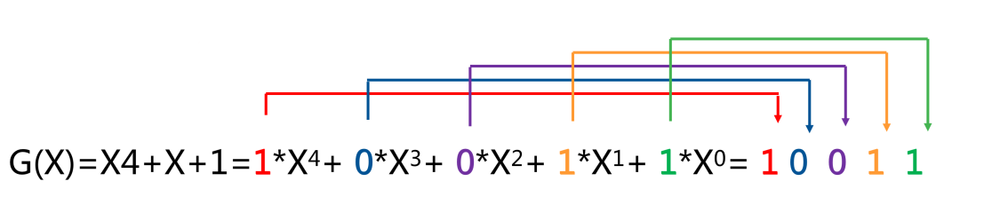

# CRC 循环冗余校验码

末尾加入 CRC 循环冗余校验码能检错不能纠错，广泛用于网络通信和磁盘存储。

1. 判断校验位数：生成多项式的最高次方是几，校验位就是几位。
2. 补齐数据位后面的 0。
3. 提取生成多项式的系数。
4. 用第二步的结果，除以第三步的结果（异或运算）余数就是 CRC 校验码，余数不够位，前面补 0。

案例：

采用 CRC 进行差错校验，生成多项式 G(X) = X4 + X + 1，信息码字为 `10111`，则计算出 CRC 校验码是 `1100`。

1. 判断校验位数：4 位检验位
2. 补齐数据位后面的 0：`10111 0000`
3. 提前生成多项式的系数：
   
4. 用第二步的结果，除以第三步的结果
