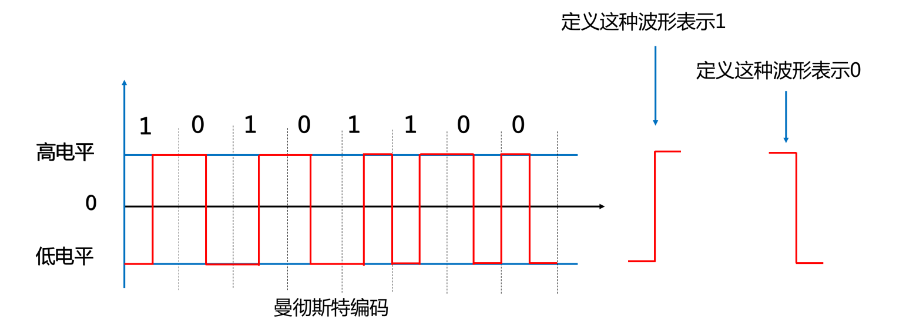
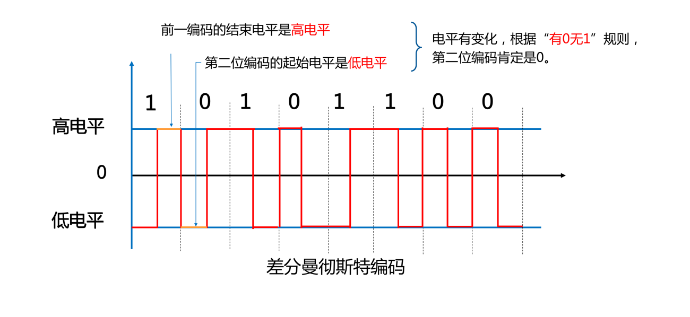

# 曼彻斯特编码

曼彻斯特编码是一种双向码，在每个比特中间有个跳变，第一个编码自定义，假如下图由高电平向低电平跳变代表“0”，由低电平向高电平跳变代表“1”。

曼彻斯特编码常用于以太网中（10M 以太网）。

# 差分曼彻斯特编码

差分曼彻斯特编码也是一种双向码，用在令牌网络中。

有跳变代表“0”，无跳变代表“1”。

不是比较形状，比较起始电平（上一个的终止与下一个起点）。

# 两种曼彻斯特编码的特点

- 曼彻斯特编码和差分曼彻斯特编码是典型的双相码，双相码要求每一位都有一个电平转换，一高一低，必须翻转。
- 曼彻斯特编码和差分曼彻斯特编码具有自定时和检测错误的功能。
- 两种曼彻斯特编码优点：将时钟和数据包含在信号数据流中，也称自同步码。
- 编码效率低：编码效率都是 50%。
- 两种曼彻斯特编码数据速率都是码元速率的一半，当数据传输速率为 100Mbps 时，码元速率为 200M baud。

# 其它编码

4B/5B：发送数据流每 4bits，先转换成 5bit，再转换为不归零码（NRZ-I），多一位用于解决同步问题。

# 各种编码效率

| 编码类型 | 编码效率 | 应用场景 |
| --- | --- | --- |
| 曼彻斯特 | 50% | 以太网（10M） |
| 差分曼彻斯特 | 50% | 令牌网络 |
| 4B/5B | 80% | 百兆以太网 100Base-TX 先 4B/5B 编码，再 MLT-3 编码 100Base-X 先 4B/5B 编码，再 NRZ-I 编码 |
| 8B/10B | 80% | 千兆以太网（1000Base-TX） |
| 4D-PAM5 | - | 1000Base-T（除 1000Base-T 外，其他千兆以太网都采用 8B/10B 编码） |
| 64B/66B | 97% | 万兆以太网 |
| MLT-3 | - | 100Base-TX |
| 8B/6T | - | 100Base-T4 |
