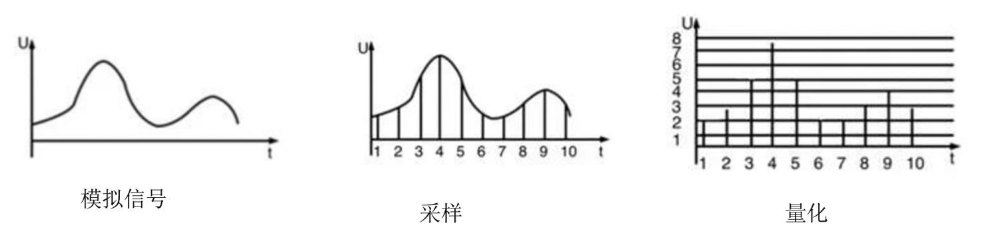

# 脉冲编码调制 PCM

常用数字化技术就是脉冲编码调制技术（Pulse Code Modulation，PCM），简称脉码调制。

PCM 数字化过程 3 个步骤：采样、量化、编码。

- 采样：按照一定时间间隔对模拟信号进行取样，把模拟信号的当前值作为样本。
  - 奈奎斯特采样定理：如果模拟信号的最高频率为 fmax，若以大小等于 2fmax 的采样频率对其进行采样，则采样得到的离散信号序列就能完整地恢复出原始信号。
  - $ f = \frac {1} {T} \geq 2f_{max} $
- 量化：把取样后得到的样本由连续值转换为离散值，离散值的个数决定了量化的精度。
- 编码：把量化后的样本值变成相应的二进制代码。

- 对声音信号数字化时，由于语音最高频率是 4kHz，所以取样频率是 8kHz。对语音样本用 128 个等级量化，因为每个样本用 7bit 表示。在数字信道上传输这种数字化后的语音信号速率是 7\*8000 = 56Kbps。
