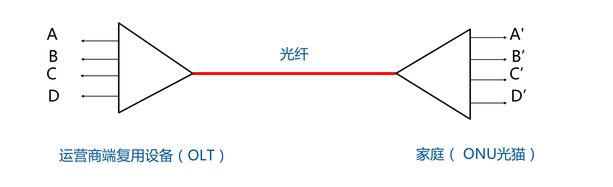
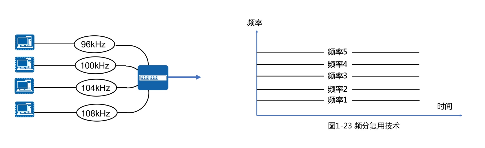
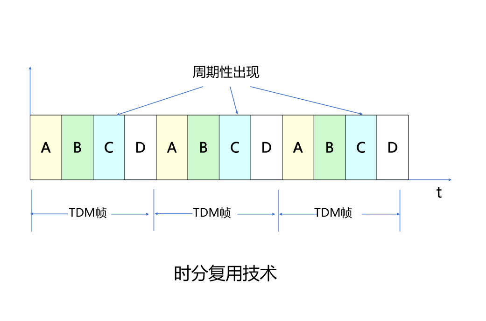
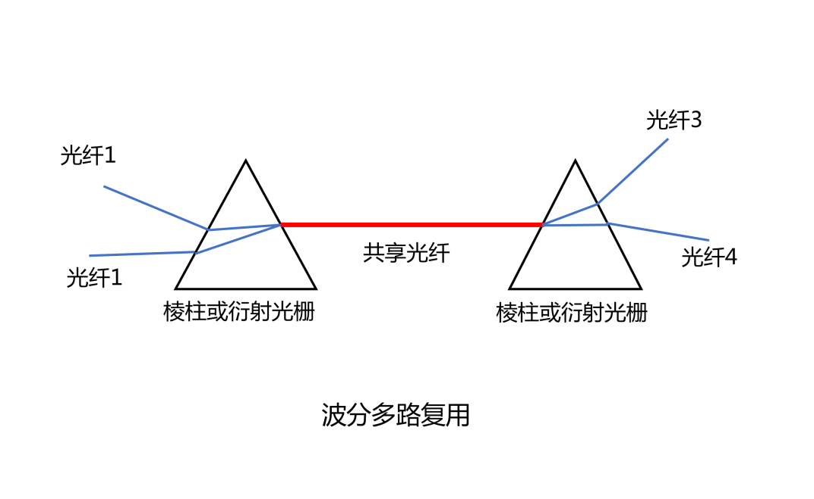
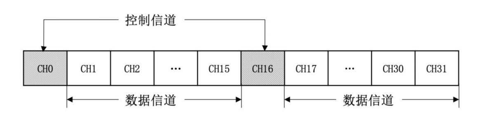

# 数字传输系统

## 多路复用技术

- 多路复用技术是把多个低速的信道组合成一个高速的信道的技术。
- 光纤入户：上网、电视、电话。
- 这种技术要用到两个设备：
  - 多路复用器，在发送端根据某种约定的规则把多个低带宽的信号复合成一个高带宽的信号。
  - 多路分配器，在接收端根据统一规则把高带宽信号分解成多个低带宽信号。
  - 多路复用器和多路分配器统称多路器，简写 MUX。

## 频分复用

频分多路复用典型应用：无线电广播、ADSL、FDD-LTE

## 时分复用

时分多路复用典型应用：T1/E1、SONET/SDH、WIFI、TDD-LTE。

## 波分复用

波分复用：本质也是频分复用

光纤频率与波长关系：光速 c = 波长 x 频率

## E1 和 T1

- 美国和日本使用 T1 标准，每路电话 64k。T1 = 64k \* 24 + 开销与间隔 = 1.544M
- 欧洲采用 E1 标准，每路电话 64k，传 30 路电话，2 路开销。E1 = 64k \* 30 + 64k \* 2 = 2.048M。
- ITU-T 标准 E1 信道数据速率是 2.048Mbps，把 32 个 8 位一组的数据样本组装成 125μs 的基本帧，其中 30 个子信道用于语言传送，2 个子信道（CH0 和 CH16）用于控制信令。

## 同步数字序列

SONET 多路复用的速率

| 光纤级 | STS 级 | 链路速 Mbps | 有效载荷 Mbps | 负载 Mbps | SDH 对应 | 常用近似值 |
| --- | --- | --- | --- | --- | --- | --- |
| OC-1 | STS-1 | 51.840 | 50.112 | 1.728 | - | - |
| OC-3 | STS-3 | 155.520 | 150.336 | 5.184 | STM-1 | 155Mbps |
| OC-9 | STS-9 | 466.560 | 451.008 | 15.552 | STM-3 | - |
| OC-12 | STS-12 | 622.080 | 601.344 | 20.736 | STM-4 | 622Mbps |
| OC-18 | STS-18 | 933.120 | 902.016 | 31.104 | STM-6 | - |
| OC-24 | STS-24 | 1244.160 | 1202.688 | 41.472 | STM-8 | - |
| OC-36 | STS-36 | 1866.240 | 1804.032 | 62.208 | STM-13 | - |
| OC-48 | STS-48 | 2488.320 | 2405.376 | 82.944 | STM-16 | 2.5Gbps |
| OC-96 | STS-96 | 4976.640 | 4810.752 | 165.888 | STM-32 | - |
| OC-192 | STS-192 | 9953.280 | 9621.504 | 331.776 | STM-64 | 10Gbps |
